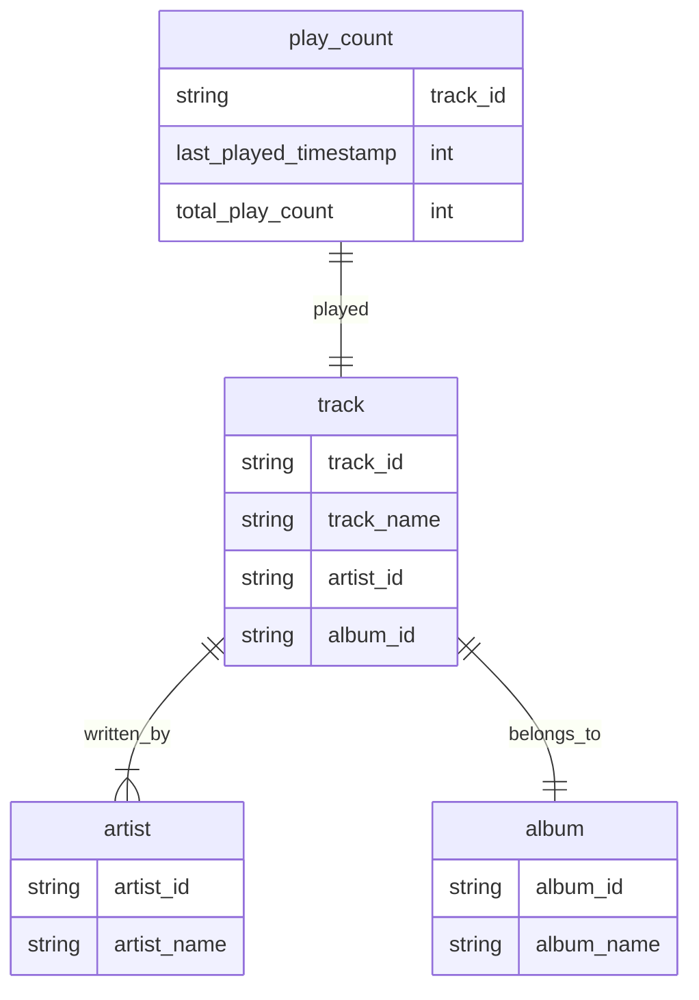

# Database Schema

```mermaid
erDiagram
    play_count {
        string track_id
        last_played_timestamp int
        total_play_count int
    }

    track {
        string track_id
        string track_name
        string artist_id
        string album_id
    }

    artist {
        string artist_id
        string artist_name
    }

    album {
        string album_id
        string album_name
    }

    play_count ||--|| track : played
    track ||--|{ artist : written_by
    track ||--|| album : belongs_to
```
